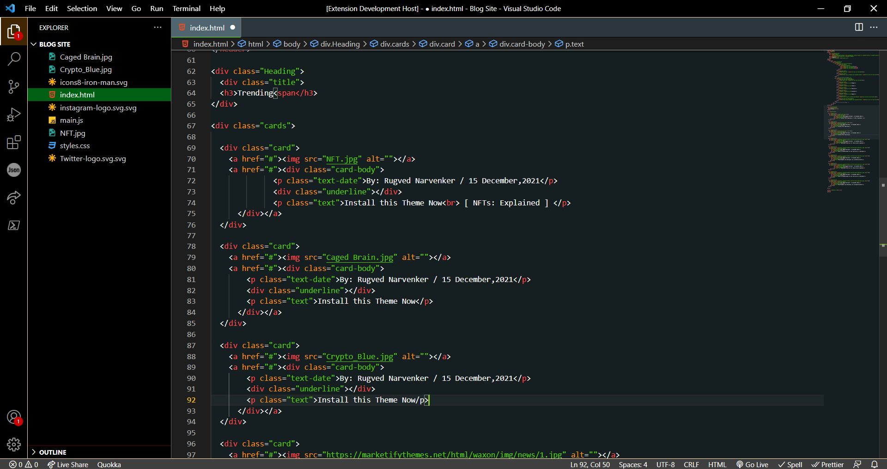
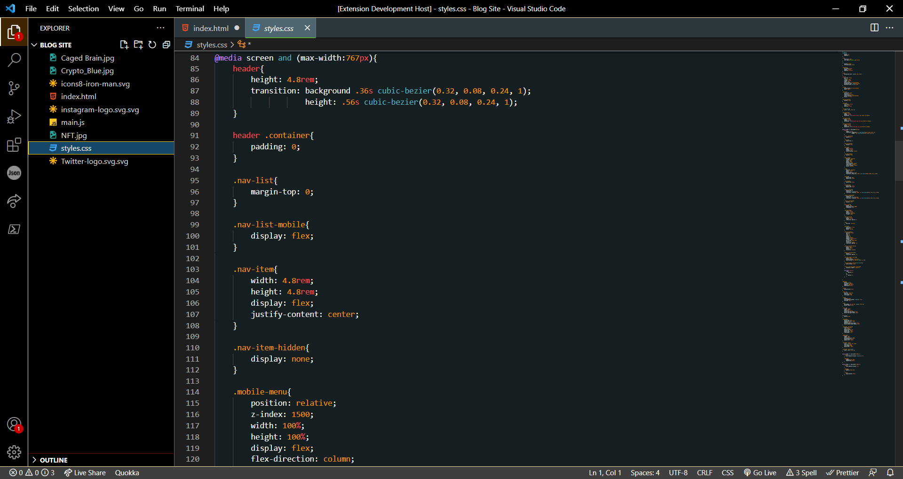

# Dark Yagami Theme
This Extension is a Dark Theme made for the coders who prefer bright text over a dim background. The colors of this theme contains hints from the color palette  of the popular anime “Death Note”. Hope you enjoy it... 

## Stats

## Preview

## Installation
- Install the theme
- Select ‘Set Color Theme’
- Click on Reload to reload VSCode
- File > Preferences > Color Theme > Dark Yagami Theme

## Feedback
- Feel free to point out any issue with the theme in the [repository](https://github.com/Rugved1512/dark-yagami-theme) or make a pull request

## Creator
- [Rugved Narvenker](https://github.com/Rugved1512)

